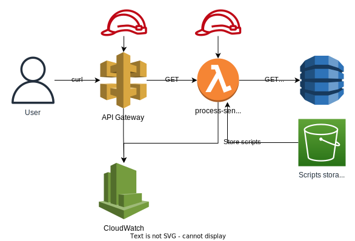

# not-so-simple-api

This API provides a simple service to replace specific words in a given sentence with their corresponding values from a key value store. It also preserves the case sensitivity of words that do not match any dictionary entries.

## Endpoint

**Request Example**
```
curl -X GET 'https://g89u8x6jjb.execute-api.eu-west-1.amazonaws.com/v1/process-word' -H 'content-type: application/json' -d '{ "sentence": "AbN and ING are two popular banks in the Netherlands" }'
```

**Response Example**
```json
{
  "mapped_sentence": "ABN AMRO and ING Bank are two popular banks in the Netherlands"
}
```

## Architecture Design

- The services used for this solution consist of classic AWS services API Gateway, Lambda, S3, and DynamoDB.
- DynamoDB was the chosen service because it's a key-valye store that is optimised to perform quick lookups which fits to help map keywords.
- In order to reduce the amount of code neccessary for the creation of the API Gateway in terraform, a Swagger json file was used as a template.
- Pre-commit and terraform-docs are used to check and validate code and automatically generate documentation.



## Postman testing

In the `/postman` folder you can find a [Postman](https://www.postman.com/downloads/) collection which can be imported to use for testing this API. The collection includes examples of sentences with lower, upper, and even mixed case keywords.

## Local deployment

**Requirements**

[pre-commit](https://pre-commit.com/) to perform checks and validation.

Install pre-commit
```
  brew install pre-commit
  pre-commit run --all-files
```

**Development**

Steps needed to dpeloy solution:
```
  terragrunt init
  terragrunt plan
  terragrunt apply
```

<!-- BEGIN_AUTOMATED_TF_DOCS_BLOCK -->
## Requirements

| Name | Version |
|------|---------|
| <a name="requirement_terraform"></a> [terraform](#requirement\_terraform) | ~> 1.5.3 |
| <a name="requirement_aws"></a> [aws](#requirement\_aws) | 5.12.0 |

## Providers

| Name | Version |
|------|---------|
| <a name="provider_aws"></a> [aws](#provider\_aws) | 5.12.0 |

## Modules

| Name | Source | Version |
|------|--------|---------|
| <a name="module_process_words"></a> [process\_words](#module\_process\_words) | terraform-aws-modules/lambda/aws | 6.0.0 |
| <a name="module_scripts"></a> [scripts](#module\_scripts) | terraform-aws-modules/s3-bucket/aws | 3.15.0 |

## Resources

| Name | Type |
|------|------|
| [aws_api_gateway_account.demo](https://registry.terraform.io/providers/hashicorp/aws/5.12.0/docs/resources/api_gateway_account) | resource |
| [aws_api_gateway_deployment.process_words](https://registry.terraform.io/providers/hashicorp/aws/5.12.0/docs/resources/api_gateway_deployment) | resource |
| [aws_api_gateway_rest_api.process_words](https://registry.terraform.io/providers/hashicorp/aws/5.12.0/docs/resources/api_gateway_rest_api) | resource |
| [aws_api_gateway_stage.process_words](https://registry.terraform.io/providers/hashicorp/aws/5.12.0/docs/resources/api_gateway_stage) | resource |
| [aws_dynamodb_table.word_map](https://registry.terraform.io/providers/hashicorp/aws/5.12.0/docs/resources/dynamodb_table) | resource |
| [aws_dynamodb_table_item.items](https://registry.terraform.io/providers/hashicorp/aws/5.12.0/docs/resources/dynamodb_table_item) | resource |
| [aws_iam_role.cloudwatch](https://registry.terraform.io/providers/hashicorp/aws/5.12.0/docs/resources/iam_role) | resource |
| [aws_iam_role_policy.cloudwatch](https://registry.terraform.io/providers/hashicorp/aws/5.12.0/docs/resources/iam_role_policy) | resource |
| [aws_lambda_permission.process_words](https://registry.terraform.io/providers/hashicorp/aws/5.12.0/docs/resources/lambda_permission) | resource |
| [aws_s3_account_public_access_block.default](https://registry.terraform.io/providers/hashicorp/aws/5.12.0/docs/resources/s3_account_public_access_block) | resource |
| [aws_caller_identity.current](https://registry.terraform.io/providers/hashicorp/aws/5.12.0/docs/data-sources/caller_identity) | data source |
| [aws_iam_policy_document.apigtw_assume](https://registry.terraform.io/providers/hashicorp/aws/5.12.0/docs/data-sources/iam_policy_document) | data source |
| [aws_iam_policy_document.cloudwatch](https://registry.terraform.io/providers/hashicorp/aws/5.12.0/docs/data-sources/iam_policy_document) | data source |
| [aws_iam_policy_document.process_words](https://registry.terraform.io/providers/hashicorp/aws/5.12.0/docs/data-sources/iam_policy_document) | data source |
| [aws_s3_object.process_words](https://registry.terraform.io/providers/hashicorp/aws/5.12.0/docs/data-sources/s3_object) | data source |

## Inputs

No inputs.

## Outputs

No outputs.
<!-- END_AUTOMATED_TF_DOCS_BLOCK -->
